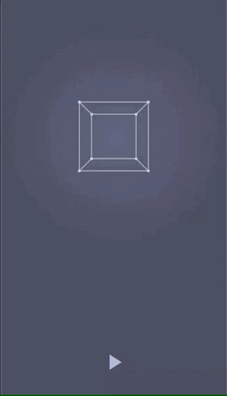

# compose-lab
A Jetpack Compose playground to play around with the APIs, try out weird/random stuff.

- Few implementations of [The Coding Train's](https://thecodingtrain.com/) P3 tutorials
- List animations, animating visibility, drawing on canvas, etc.
- Random demos taken from [compose source](https://cs.android.com/androidx/platform/frameworks/support/+/androidx-main:compose/)

cube | hypercube | drag + 3d rotation
-- | -- | --
 |  | 

#### License

